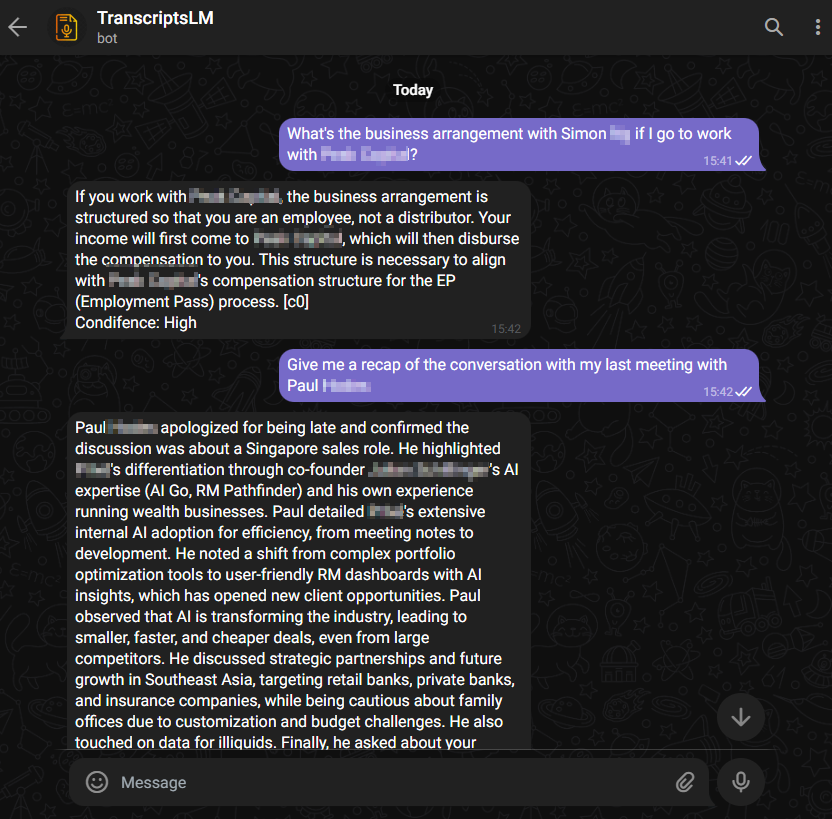
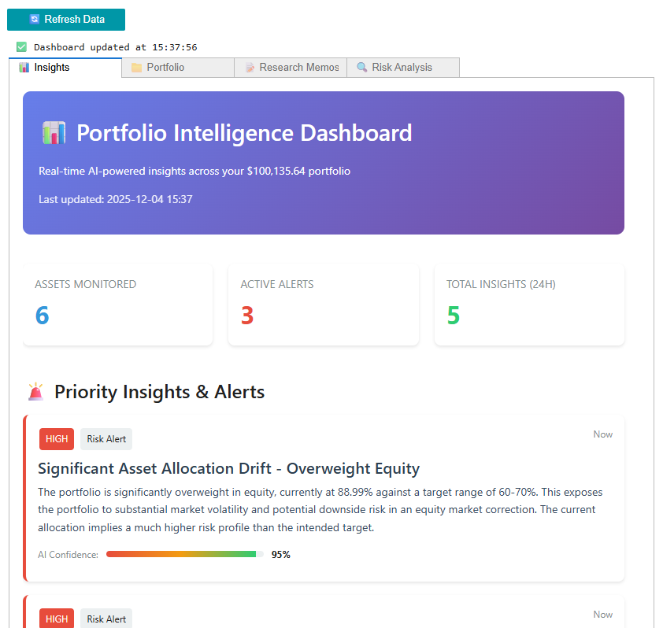
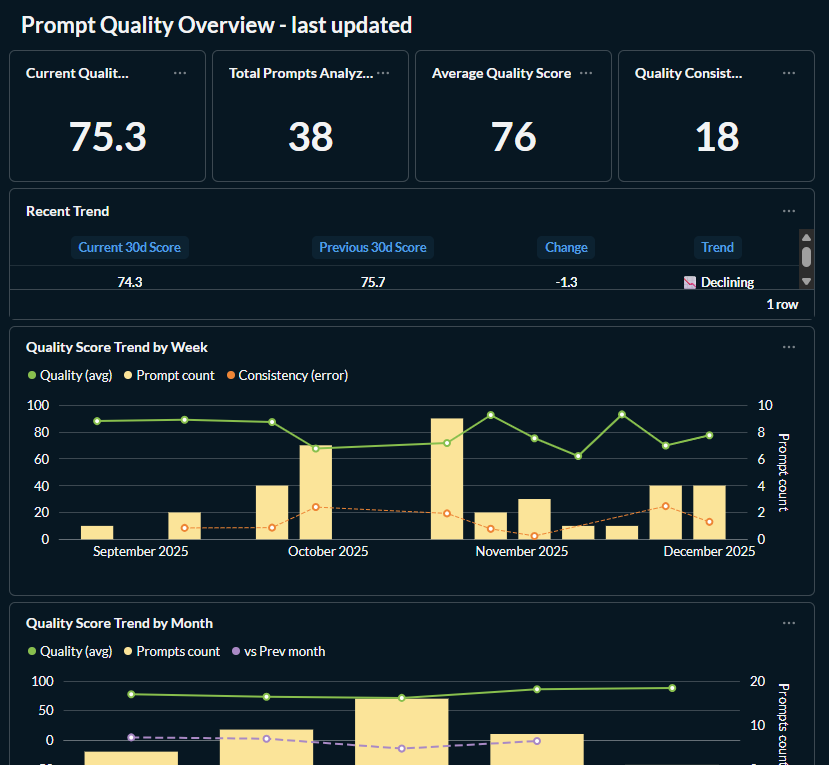

# 👋 Building AI Systems for Financial Markets

**Former Reuters/Bloomberg engineer pivoting to AI/ML engineering in buy-side finance.**

I build production-grade RAG systems, intelligent automation, and data infrastructure that solve real workflow problems for portfolio managers, analysts, and data teams at asset managers and private banks.

---

## 🎯 What I Build

**RAG Systems** • **Intelligent Automation** • **Financial Data Infrastructure**

My focus: bridging financial domain expertise with modern AI capabilities to create tools that actually get adopted and drive measurable outcomes.

---

## 🚀 Featured Projects

### 📋 Meeting Intelligence RAG System
**Problem:** Sales teams and PMs lose 5-8 hours weekly digitizing meeting notes into CRM systems  
**Solution:** End-to-end RAG pipeline with speaker identification, metadata extraction, and conversational search via Telegram  
**Impact:** 75% time reduction, 250+ meetings processed, 100% automated CRM data capture  
**Tech:** Python • LangChain • PostgreSQL+pgvector • Gemini Pro • Claude • n8n  

  

📄 [Full Case Study](https://github.com/zoubinho/profile/blob/ceb3b137e5fc048d7e81bcb01013f8918ba1da07/AI-Financial%20Apps%20Portfolio%20-%20Alexandre%20Alesi.pdf) | 🔗 [Live Demo (upon request)](#)

---

### 📊 Automated Portfolio Intelligence System
**Problem:** Portfolio managers spend 15-20 hours weekly on routine research across 20-100 positions  
**Solution:** AI-powered scheduled workflows generating daily market intelligence, risk alerts, and research memos with confidence scoring  
**Impact:** 60-70% time savings, 12-24 hour information lead time on material portfolio events, scalable to 100+ positions  
**Tech:** Python • GPT-4 • Claude • PostgreSQL • n8n • Jupyter • Docker • Webhooks  

  

📄 [Full Case Study](https://github.com/zoubinho/profile/blob/ceb3b137e5fc048d7e81bcb01013f8918ba1da07/AI-Financial%20Apps%20Portfolio%20-%20Alexandre%20Alesi.pdf) | 🔗 [Live Demo (upon request)](#)

---

### 🎯 Prompt Engineering Quality Platform
**Problem:** Organizations face 10x variance in AI output quality due to poor prompting skills  
**Solution:** Real-time prompt analysis system with multi-dimensional scoring, thematic categorization, and self-serve analytics dashboard  
**Impact:** 20% quality improvement over 3 months, 40% reduction in wasted iterations  
**Tech:** Python • Gemini 2.0 • PostgreSQL • Metabase • n8n • Docker  

  

📄 [Full Case Study](https://github.com/zoubinho/profile/blob/ceb3b137e5fc048d7e81bcb01013f8918ba1da07/AI-Financial%20Apps%20Portfolio%20-%20Alexandre%20Alesi.pdf) | 🔗 [Live Demo (upon request)](#)

---

## 💼 Professional Background

**Current:** Building AI systems for financial workflows (personal projects + consulting)  
**Previously:**  
- Reuters: Market data infrastructure, real-time systems  
- Bloomberg: Terminal features, quatitative modelling, data pipeline engineering  
- swissQuant: Portfolio analytics & Optimization platforms  

**Domain Expertise:** Market data • Portfolio management workflows • Investment research • Risk analysis • Trading systems

---

## 🛠️ Technical Stack

**AI & LLM:**  
OpenAI GPT-4 • Anthropic Claude • Google Gemini • LangChain • RAG Systems • Prompt Engineering

**Data Infrastructure:**  
PostgreSQL • Vector Databases (pgvector) • SQL • Data Modeling • ETL Pipelines

**Orchestration & Automation:**  
n8n • Webhook APIs • Event-Driven Architecture • Scheduled Workflows

**Development & Deployment:**  
Python • Docker • Git • Self-Hosted Infrastructure • API Integration • CI/CD

**Financial Domain:**  
Market Data (Reuters/Bloomberg) • Portfolio Management • Investment Research • Risk Analysis • CRM Systems (Salesforce)

**Analytics & Visualization:**  
Jupyter Notebooks • Metabase • Dashboard Design • Data Storytelling

---

## 📈 What Makes My Work Different

**1. Domain-Driven Design**  
Every system is built around actual financial workflows, not generic AI demos. I understand PM/analyst pain points because I've worked in financial data infrastructure for years.

**2. Production Quality from Day One**  
My projects include error handling, monitoring, audit trails, and cost optimization. They're designed to be deployed, not just prototyped.

**3. Measurable Business Impact**  
All projects have clear KPIs: time savings, accuracy improvements, adoption metrics. I build to solve problems, not to showcase technology.

**4. Cost-Conscious Architecture**  
Self-hosted where it makes sense, leveraging open-source tools. My Portfolio Intelligence System costs $10/month vs $500+ for SaaS alternatives.

---

## 🎓 Current Learning Focus

- Advanced RAG architectures (hybrid search, reranking, query decomposition)
- Agentic workflows with n8n and Claude/Gemini (prompt chaining, orchestration-worker, agents)
- Production ML observability and evaluation frameworks
- Financial time series analysis with transformer models

---

## 📫 Let's Connect

**Open to opportunities in:**
- Hedge Funds & Asset Managers (AI/ML Engineering, Quantitative Development)
- Private Banks (Data Infrastructure, Analytics Teams)
- Fintech (AI-powered research tools, data platforms)

**Ideal roles:**  
AI/ML Solutions Engineer • Quantitative Strategist • Data Infrastructure Engineer 

---

**🔗 Links:**  
[LinkedIn](https://linkedin.com/in/alexandrealesi) • [Portfolio PDF](https://github.com/zoubinho/profile/blob/main/AI-Financial%20Apps%20Portfolio%20-%20Alexandre%20Alesi.pdf)

---

**💡 Why I'm pivoting to buy-side AI:**

I spent years building data infrastructure at market data vendors. I know the tooling, the workflows, the pain points. Now I'm applying modern AI capabilities to solve the problems I watched portfolio managers and analysts struggle with daily.

The future belongs to firms that augment human judgment with intelligent systems—not replace it, but systematically enhance it. That's what I build.

---

_Last updated: December 2025_
